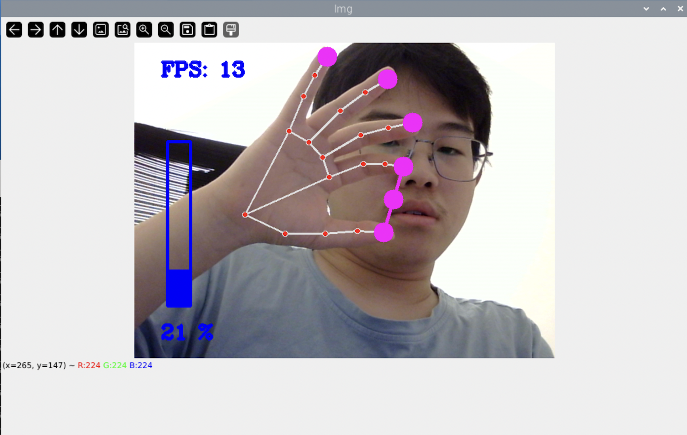
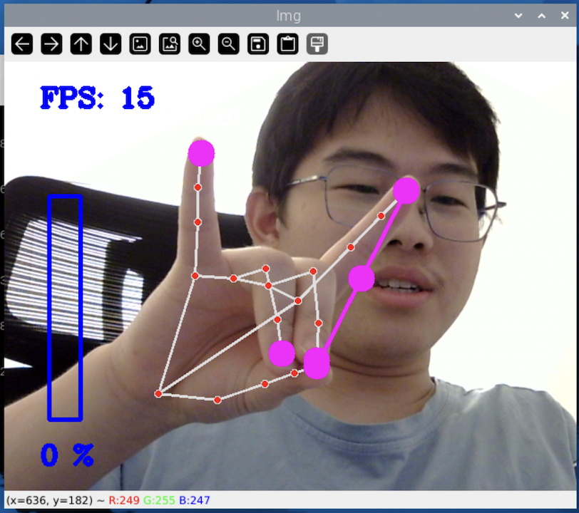

# Observant Systems

**Dean Xu - hx332**

**Yoyo Wang - hw867**
## Prep

1.  Install VNC on your laptop if you have not yet done so. This lab will actually require you to run script on your Pi through VNC so that you can see the video stream. Please refer to the [prep for Lab 2](https://github.com/FAR-Lab/Interactive-Lab-Hub/blob/-/Lab%202/prep.md#using-vnc-to-see-your-pi-desktop).
2.  Install the dependencies as described in the [prep document](prep.md). 
3.  Read about [OpenCV](https://opencv.org/about/),[Pytorch](https://pytorch.org/), [MediaPipe](https://mediapipe.dev/), and [TeachableMachines](https://teachablemachine.withgoogle.com/).
4.  Read Belloti, et al.'s [Making Sense of Sensing Systems: Five Questions for Designers and Researchers](https://www.cc.gatech.edu/~keith/pubs/chi2002-sensing.pdf).

### You will need:
1. Raspberry Pi
1. Webcam 

## Overview

A) [Play](#part-a)

B) [Fold](#part-b)

C) [Flight test](#part-c)

D) [Reflect](#part-d)

---

### Part A
### Play with different sense-making algorithms.

#### Pytorch for object recognition

To get started, install dependencies into a virtual environment for this exercise as described in [prep.md](prep.md).

Make sure your webcam is connected.

You can check the installation by running:

```
python -c "import torch; print(torch.__version__)"
```

If everything is ok, you should be able to start doing object recognition. For this default example, we use [MobileNet_v2](https://arxiv.org/abs/1801.04381). This model is able to perform object recognition for 1000 object classes (check [classes.json](classes.json) to see which ones.

Start detection by running  

```
python infer.py
```

The first 2 inferences will be slower. Now, you can try placing several objects in front of the camera.

Log output of infer.py:

```
(.venv) pi@max:~/Interactive-Lab-Hub/Lab 5 $ python infer.py
/home/pi/Interactive-Lab-Hub/Lab 5/.venv/lib/python3.11/site-packages/torchvision/models/_utils.py:208: UserWarning: The parameter 'pretrained' is deprecated since 0.13 and may be removed in the future, please use 'weights' instead.
  warnings.warn(
/home/pi/Interactive-Lab-Hub/Lab 5/.venv/lib/python3.11/site-packages/torchvision/models/_utils.py:223: UserWarning: Arguments other than a weight enum or `None` for 'weights' are deprecated since 0.13 and may be removed in the future. The current behavior is equivalent to passing `weights=MobileNet_V2_QuantizedWeights.IMAGENET1K_QNNPACK_V1`. You can also use `weights=MobileNet_V2_QuantizedWeights.DEFAULT` to get the most up-to-date weights.
  warnings.warn(msg)
/home/pi/Interactive-Lab-Hub/Lab 5/.venv/lib/python3.11/site-packages/torch/ao/quantization/utils.py:435: UserWarning: must run observer before calling calculate_qparams. Returning default values.
  warnings.warn(
/home/pi/Interactive-Lab-Hub/Lab 5/.venv/lib/python3.11/site-packages/torch/_utils.py:444: UserWarning: TypedStorage is deprecated. It will be removed in the future and UntypedStorage will be the only storage class. This should only matter to you if you are using storages directly.  To access UntypedStorage directly, use tensor.untyped_storage() instead of tensor.storage()
  device=storage.device,
read
image (144, 176, 3)
read
image (144, 176, 3)
read
image (144, 176, 3)
read
image (144, 176, 3)
read
image (144, 176, 3)
read
image (144, 176, 3)
read
image (144, 176, 3)
read
image (144, 176, 3)
read
image (144, 176, 3)
read
image (144, 176, 3)
read
image (144, 176, 3)
read
image (144, 176, 3)
preprocessing finished
30.05% laptop, laptop computer
18.98% notebook, notebook computer
11.295952801385365 fps
```


### Machine Vision With Other Tools
The following sections describe tools ([MediaPipe](#mediapipe) and [Teachable Machines](#teachable-machines)).

#### MediaPipe

A recent open source and efficient method of extracting information from video streams comes out of Google's [MediaPipe](https://mediapipe.dev/), which offers state of the art face, face mesh, hand pose, and body pose detection.

To get started, install dependencies into a virtual environment for this exercise as described in [prep.md](prep.md):

Each of the installs will take a while, please be patient. After successfully installing mediapipe, connect your webcam to your Pi and use **VNC to access to your Pi**, open the terminal, and go to Lab 5 folder and run the hand pose detection script we provide:
(***it will not work if you use ssh from your laptop***)

```
(venv-ml) pi@ixe00:~ $ cd Interactive-Lab-Hub/Lab\ 5
(venv-ml) pi@ixe00:~ Interactive-Lab-Hub/Lab 5 $ python hand_pose.py
```
Test photos:






#### Moondream Vision-Language Model

[Moondream](https://www.ollama.com/library/moondream) is a lightweight vision-language model that can understand and answer questions about images. Unlike the classification models above, Moondream can describe images in natural language and answer specific questions about what it sees.

To use Moondream, first make sure Ollama is running and pull the model:
```bash
ollama pull moondream
```

Then run the simple demo script:
```bash
python moondream_simple.py
```

This will capture an image from your webcam and let you ask questions about it in natural language. Note that vision-language models are slower than classification models (responses may take up to minutes on a Raspberry Pi). There are newer models like [LFM2-VL](https://huggingface.co/LiquidAI/LFM2-VL-450M-GGUF), but many are very recent and not yet optimized for embedded devices.

**Design consideration**: Think about how slower response times change your interaction design. What kinds of observant systems benefit from thoughtful, delayed responses rather than real-time classification? Consider systems that monitor over longer time periods or provide periodic summaries rather than instant feedback.

#### Teachable Machines
Google's [TeachableMachines](https://teachablemachine.withgoogle.com/train) is very useful for prototyping with the capabilities of machine learning. We are using [a python package](https://github.com/MeqdadDev/teachable-machine-lite) with tensorflow lite to simplify the deployment process.


To get started, install dependencies into a virtual environment for this exercise as described in [prep.md](prep.md):

After installation, connect your webcam to your Pi and use **VNC to access to your Pi**, open the terminal, and go to Lab 5 folder and run the example script:
(***it will not work if you use ssh from your laptop***)


```
(venv-tml) pi@ixe00:~ Interactive-Lab-Hub/Lab 5 $ python tml_example.py
```


Next train your own model. Visit [TeachableMachines](https://teachablemachine.withgoogle.com/train), select Image Project and Standard model. The raspberry pi 4 is capable to run not just the low resource models. Second, use the webcam on your computer to train a model. *Note: It might be advisable to use the pi webcam in a similar setting you want to deploy it to improve performance.*  For each class try to have over 150 samples, and consider adding a background or default class where you have nothing in view so the model is trained to know that this is the background. Then create classes based on what you want the model to classify. Lastly, preview and iterate. Finally export your model as a 'Tensorflow lite' model. You will find an '.tflite' file and a 'labels.txt' file. Upload these to your pi (through one of the many ways such as [scp](https://www.raspberrypi.com/documentation/computers/remote-access.html#using-secure-copy), sftp, [vnc](https://help.realvnc.com/hc/en-us/articles/360002249917-VNC-Connect-and-Raspberry-Pi#transferring-files-to-and-from-your-raspberry-pi-0-6), or a connected visual studio code remote explorer).


Include screenshots of your use of Teachable Machines, and write how you might use this to create your own classifier. Include what different affordances this method brings, compared to the OpenCV or MediaPipe options.

#### (Optional) Legacy audio and computer vision observation approaches
In an earlier version of this class students experimented with observing through audio cues. Find the material here:
[Audio_optional/audio.md](Audio_optional/audio.md). 
Teachable machines provides an audio classifier too. If you want to use audio classification this is our suggested method. 

In an earlier version of this class students experimented with foundational computer vision techniques such as face and flow detection. Techniques like these can be sufficient, more performant, and allow non discrete classification. Find the material here:
[CV_optional/cv.md](CV_optional/cv.md).

### Part B
### Construct a simple interaction.

* Pick one of the models you have tried, and experiment with prototyping an interaction.
* This can be as simple as the boat detector shown in lecture.
* Try out different interaction outputs and inputs.


**\*\*\*Describe and detail the interaction, as well as your experimentation here.\*\*\***

### Part C
### Test the interaction prototype

Now flight test your interactive prototype and **note down your observations**:
For example:
1. When does it what it is supposed to do?
1. When does it fail?
1. When it fails, why does it fail?
1. Based on the behavior you have seen, what other scenarios could cause problems?

**\*\*\*Think about someone using the system. Describe how you think this will work.\*\*\***
1. Are they aware of the uncertainties in the system?
1. How bad would they be impacted by a miss classification?
1. How could change your interactive system to address this?
1. Are there optimizations you can try to do on your sense-making algorithm.

### Part D
### Characterize your own Observant system

Now that you have experimented with one or more of these sense-making systems **characterize their behavior**.
During the lecture, we mentioned questions to help characterize a material:
* What can you use X for?
* What is a good environment for X?
* What is a bad environment for X?
* When will X break?
* When it breaks how will X break?
* What are other properties/behaviors of X?
* How does X feel?

**\*\*\*Include a short video demonstrating the answers to these questions.\*\*\***

### Part 2.

Following exploration and reflection from Part 1, finish building your interactive system, and demonstrate it in use with a video.

**\*\*\*Include a short video demonstrating the finished result.\*\*\***
